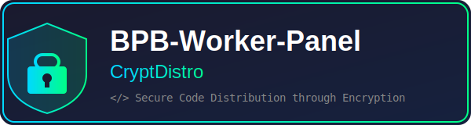

# BPB-Worker-Panel-CryptDistro

**[中文版](README_zh.md)** | English

### Secure Code Distribution through Encryption and Obfuscation

## Features

- **Advanced Encryption**: Utilize state-of-the-art encryption techniques to safeguard your code from unauthorized access and tampering.
- **Obfuscation Capabilities**: Protect your code from reverse engineering, making it difficult for malicious actors to understand or modify your code.
- **Automated Workflow**: Check for upstream updates daily and automatically build, obfuscate, and publish new releases.
- **Cloudflare Workers Ready**: Output is optimized for Cloudflare Pages deployment.

## Recommended Deployment Method

1. Download the Release package from GitHub Releases.
2. Create a new project in Cloudflare Pages.
3. Upload the distributed zip file (`_worker.zip`).
4. Proceed with the deployment.

> For more detailed information, please refer to: [Installation (Pages - New recommended method)](https://github.com/bia-pain-bache/BPB-Worker-Panel/blob/main/docs/pages_upload_installation_fa.md)

## Configuration

### Environment Variables

The workflow uses the following environment variables that you can customize:

| Variable | Default | Description |
|----------|---------|-------------|
| `TARGET_REPO` | `bia-pain-bache/BPB-Worker-Panel` | Upstream repository to fetch source code from |
| `ENTRY_DIR` | `src` | Directory containing the entry file |
| `ENTRY_NAME` | `worker` | Entry file name without extension |

### Workflows

- **`build.yml`**: Daily scheduled build that checks for upstream releases and creates a new release if updates are available.
- **`build-night.yml`**: Nightly build based on the latest commit, creates pre-release versions.

## Obfuscation Options

The obfuscator configuration (`obfuscator.json`) includes:

- High obfuscation preset
- String array encoding (RC4 + Base64)
- Mangled identifier names
- Dead code injection (50% threshold)
- Unicode escape sequences

## License

This project is provided for secure code distribution purposes.
